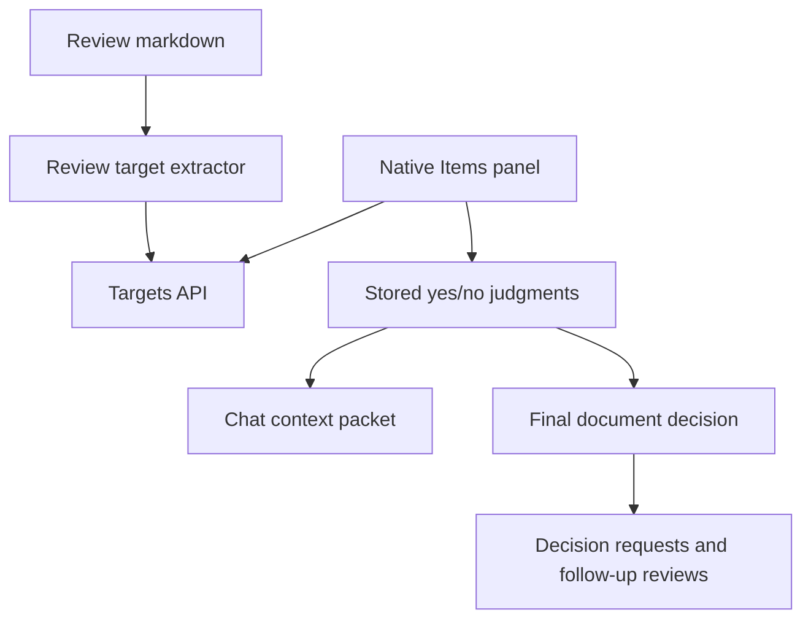

# feat: Native review target approvals

## Summary

Add first-class review targets so the native app can yes/no each item in an approval list before the user submits the final review decision. The feature preserves the existing document-level decision contract: per-target judgments become structured evidence for chat, final decisions, and downstream requests instead of a separate workflow.

---

## Problem Frame

Turf Review already supports free-form notes, Pencil annotations, chat, and one final document decision. That works for prose reviews, but it underserves review packets whose core content is a list of items that each need a yes/no call. The native app needs a durable per-item approval surface that stays faster than ad hoc notes and still feeds the same downstream action machinery.

---

## Assumptions

- Positive final decisions such as `Approve`, `Execute`, and `Send` should require every extracted review target to have a yes/no verdict when a review has targets.
- Rework and kill-style decisions should remain available even when targets are undecided.
- Per-target feedback can satisfy the feedback requirement for rework-style decisions when the target feedback names the required change.
- V1 should extract review targets from explicit checklist-like Markdown first and avoid turning every ordinary bullet into mandatory work.

---

## Requirements

**Target discovery and storage**

- R1. The backend exposes stable review targets for list items that are meant to be approved or rejected.
- R2. Repeated loads of the same review must not duplicate targets or lose existing judgments.
- R3. Old reviews without review targets continue to behave like current reviews.

**Per-target judgment**

- R4. The native app lets the user set each target to yes or no, clear a mistaken judgment, and add optional feedback.
- R5. Rejected targets can carry feedback that travels with the final decision.
- R6. Stale responses for another selected review cannot mutate the current review's target state.

**Final decision and handoff**

- R7. Positive final decisions are blocked when a target-bearing review still has undecided targets.
- R8. Final decisions, chat context, and downstream request payloads include compact per-target judgment data.
- R9. Existing annotations, image compaction, retry handling, and decision follow-up behavior remain intact.

---

## Key Technical Decisions

- KTD1. Store review targets separately from annotations: annotations stay free-form human context, while targets and judgments model yes/no state. This avoids overloading note rows with workflow semantics.
- KTD2. Treat explicit checklist/list patterns as the V1 source of targets: the extractor should prefer Markdown task-list items and list blocks under approval-like headings. Broad automatic bullet capture would create busywork.
- KTD3. Keep final decisions as the package point: saving a target judgment updates context, but only the final decision creates downstream requests. This follows the existing annotation invariant.
- KTD4. Enforce positive-decision completeness on the server and mirror it in native UI: native controls should guide the user, but the backend owns the contract.
- KTD5. Package target judgments through the same compact context path as annotations: downstream chat and action requests receive target text, verdict, feedback, and anchors, never raw display payloads.

---

## High-Level Technical Design

The target lifecycle has three states: `unset`, `approved`, and `rejected`. `unset` keeps the row open. `approved` records a yes. `rejected` records a no and should prompt for short feedback when the final decision path needs actionable rework context.

---

## Implementation Units

### U1. Backend target extraction and persistence

**Goal:** Add durable review targets keyed to a review slug and stable document anchor.

**Requirements:** R1, R2, R3

**Dependencies:** none

**Files:** `lib/db.js`, `lib/reviews/repository.js`, `lib/reviews/review-targets.js`, `server.js`, `test/review-targets.test.js`

**Approach:** Add additive tables for extracted targets and current judgments. The extractor should parse Markdown, generate stable keys from list position plus normalized text hash, and upsert targets on item load or publish without overwriting judgments. Return an empty target list for documents that do not expose approval-like list structure.

**Patterns to follow:** Use the additive schema style in `lib/db.js`, prepared statements in `lib/reviews/repository.js`, and the current annotation route shape in `server.js`.

**Test scenarios:**

- Markdown with task-list items returns one target per item with stable keys, labels, ordinal order, and anchor refs.
- Re-running extraction for the same slug returns the same target keys and does not duplicate rows.
- A changed list label creates a new target key while preserving old judgments as historical rows that no longer appear in the active list.
- Plain prose and generic bullets outside approval-like sections return an empty target list.
- A legacy review with no targets still returns a valid empty response.

**Verification:** The backend can load target-bearing and targetless reviews without changing existing item list, annotation, or decision responses.

### U2. Judgment API and final-decision semantics

**Goal:** Persist per-target yes/no judgments and include them in the final decision contract.

**Requirements:** R4, R5, R7, R8, R9

**Dependencies:** U1

**Files:** `server.js`, `lib/reviews/decision-contract.js`, `lib/reviews/orchestrator.js`, `lib/chat/openclaw-context.js`, `test/review-targets.test.js`, `test/decision-contract.test.js`, `test/decision-orchestrator.test.js`, `test/chat-context.test.js`

**Approach:** Add target-list and target-judgment endpoints under the existing item API. The decision route should load compact target judgments before decomposition. Positive decisions should reject incomplete target-bearing reviews. Rework-style decisions should accept either free-form feedback or rejected-target feedback as actionable feedback.

**Patterns to follow:** Mirror the slug validation and compact handoff rules used by annotations, especially the image-data guard in `lib/chat/openclaw-context.js`.

**Test scenarios:**

- Setting a target to approved persists the verdict and returns the updated target summary.
- Setting a target to rejected persists feedback and includes it in chat context and decision payloads.
- Clearing a target judgment returns it to `unset` and updates completion counts.
- Invalid verdicts, unknown target keys, and wrong-slug target updates fail without mutating state.
- A positive final decision with one unset target returns a clear validation error and leaves the review pending.
- A positive final decision with all targets decided proceeds through the existing `decisions` and `decision_requests` path.
- A rework decision with rejected-target feedback but no free-form feedback satisfies the feedback requirement.
- Image annotations still omit raw image data from chat and decision context.

**Verification:** The server contract proves target judgments affect decision readiness while preserving the current downstream request model.

### U3. Native models, client, and store state

**Goal:** Load, mutate, and preserve review targets in the native app.

**Requirements:** R4, R5, R6, R8

**Dependencies:** U1, U2

**Files:** `TurfReviewNative/TurfReviewNative/Models/TurfModels.swift`, `TurfReviewNative/TurfReviewNative/Services/TurfReviewClient.swift`, `TurfReviewNative/TurfReviewNative/State/ReviewStore.swift`, `TurfReviewNative/TurfReviewNative/Services/DemoData.swift`, `TurfReviewNative/TurfReviewNativeTests/ReviewStoreTests.swift`, `TurfReviewNative/TurfReviewNativeTests/TurfReviewClientTests.swift`

**Approach:** Add native target and judgment models, client methods, and store state that load alongside annotations and actions. Preserve accepted local judgments through refreshes, clear them on configuration change, and reject stale updates using the same revision and slug guards already used for annotations, chat, decisions, and retries.

**Patterns to follow:** Reuse the `capture` detail-loading pattern, response-integrity validation style, and accepted-state override pattern in `ReviewStore.swift`.

**Test scenarios:**

- Loading review detail populates targets, annotations, actions, audio status, and chat without one failed section blanking the others.
- Saving a yes verdict updates the target row and completion summary.
- Saving a no verdict with feedback updates the row and leaves annotations unchanged.
- A slow target update for a previous selection does not mutate the new selected review.
- A configuration change clears in-flight target update gates and accepted target overrides.
- Demo mode can show target rows and accept local judgments without network calls.

**Verification:** Native store tests cover target state with the same race and stale-response rigor as annotations and decisions.

### U4. Native Items panel and document highlighting

**Goal:** Give the user a fast target-by-target approval surface inside the native review workspace.

**Requirements:** R4, R5, R7

**Dependencies:** U3

**Files:** `TurfReviewNative/TurfReviewNative/Views/ReviewDetailView.swift`, `TurfReviewNative/TurfReviewNative/Views/ReviewTargetsPanel.swift`, `TurfReviewNative/TurfReviewNative/Views/DecisionPanel.swift`, `TurfReviewNative/TurfReviewNative/Support/HTMLDocumentView.swift`, `TurfReviewNative/TurfReviewNative/Support/TurfTheme.swift`, `TurfReviewNative/TurfReviewNativeTests/ReviewStoreTests.swift`

**Approach:** Add an `Items` inspector tab with compact rows, yes/no controls, and inline feedback for rejected rows. Show a completion summary near the final decision controls. Highlight target anchors in the document and preserve the current text-first annotation flow.

**Patterns to follow:** Match the segmented inspector in `ReviewDetailView.swift`, the stable row sizing style in `DecisionPanel.swift`, and the annotation highlight injection in `HTMLDocumentView.swift`.

**Test scenarios:**

- Targetless reviews do not add noise to the decision flow.
- A target-bearing review shows counts for approved, rejected, and undecided rows.
- Positive final decision controls stay disabled while targets remain undecided.
- Rejected rows expose a feedback field without forcing feedback onto approved rows.
- Target highlights render separately from annotation highlights and do not erase annotation marks.
- Switching reviews resets local target editor drafts.

**Verification:** Simulator and iPad smoke confirm the Items panel fits regular and compact layouts, target controls do not shift the inspector, and document highlights remain readable.

### U5. Handoff documentation and regression coverage

**Goal:** Make the new target contract discoverable for future review-packet publishers and implementers.

**Requirements:** R1, R8, R9

**Dependencies:** U1, U2, U3, U4

**Files:** `README.md`, `ARCHITECTURE.md`, `ANNOTATION-SPEC.md`, `test/chat-context.test.js`, `TurfReviewNative/TurfReviewNativeTests/ReviewStoreTests.swift`

**Approach:** Document how a review packet should mark approval targets, how target judgments differ from annotations, and how final decisions package both. Keep the docs focused on contracts and examples, not implementation internals.

**Patterns to follow:** Extend the current README model bullets and architecture contract language.

**Test scenarios:**

- Chat context tests show annotations and target judgments in the same packet without conflating their shapes.
- Store tests prove target judgments survive the main decision flow and do not break action/status reloads.
- Documentation examples match the extractor fixtures used in backend tests.

**Verification:** A reviewer can publish a Markdown packet with approval targets, open it in native Turf Review, yes/no each target, and submit a final decision that carries the structured target outcomes downstream.

---

## Acceptance Examples

- AE1. Given a review packet with five explicit approval targets, when the native app loads the item, then the Items panel shows five rows with `unset` verdicts and a `0/5 decided` summary.
- AE2. Given one row is rejected with feedback, when the user asks chat about the review, then chat context includes that target text, verdict, and feedback.
- AE3. Given one row is still unset, when the user tries a positive final decision, then the server rejects the decision and the review remains pending.
- AE4. Given all rows are yes/no'd, when the user submits `Execute`, then the review leaves pending and downstream requests receive the compact target judgment list.
- AE5. Given a review has no extracted targets, when the user submits a normal decision, then behavior matches the current app.

---

## Scope Boundaries

### In Scope

- Backend storage, extraction, API, and decision-context integration for review targets.
- Native iPhone/iPad UI for loading, editing, and summarizing per-target verdicts.
- Server-side enforcement for positive final decisions on target-bearing reviews.
- Regression coverage for backend contracts and native store behavior.

### Deferred to Follow-Up Work

- Updating the source Markdown file with checked boxes after final approval.
- Web dashboard parity beyond showing stored target summaries on existing review pages.
- Bulk approval shortcuts such as `approve all remaining`.
- Target extraction from arbitrary tables, CSVs, or embedded HTML lists.
- Analytics over target rejection rates.

### Outside This Feature

- Replacing document-level decisions with per-target-only workflows.
- Changing the existing downstream action runner model.
- Making saved annotations trigger work before the final review decision.

---

## Risks & Dependencies

- Extraction false positives could make reviews feel busy. Keep V1 target sources explicit and test examples from real review packets.
- Anchor stability can drift if rendered HTML changes. Store target keys from Markdown text and ordinal data, and use anchors for navigation only.
- Decision gating can frustrate users if a packet contains non-mandatory bullets. The extractor should err toward fewer targets and leave broad heuristics for later.
- Backend tests may need the Volta Node runtime when `better-sqlite3` bindings drift.
- Native proof needs simulator coverage and a physical iPad pass because the review workspace depends on iPad layout, selection, and Pencil paths.

---

## Sources & Research

- `README.md` defines current canonical decisions, final decision behavior, and downstream request semantics.
- `ARCHITECTURE.md` states that a review decision must end in durable proof, visible clarification, or terminal dismissal.
- `lib/db.js`, `lib/reviews/repository.js`, `server.js`, and `lib/reviews/decision-contract.js` show the current additive schema, item routes, annotation routes, and decision decomposition path.
- `lib/chat/openclaw-context.js` and `test/chat-context.test.js` establish the compact handoff rule for image annotations.
- `TurfReviewNative/TurfReviewNative/State/ReviewStore.swift`, `TurfReviewNative/TurfReviewNative/Views/DecisionPanel.swift`, `TurfReviewNative/TurfReviewNative/Views/AnnotationPanel.swift`, and `TurfReviewNative/TurfReviewNative/Support/HTMLDocumentView.swift` establish the native detail-loading, final decision, annotation, and highlight patterns to extend.
