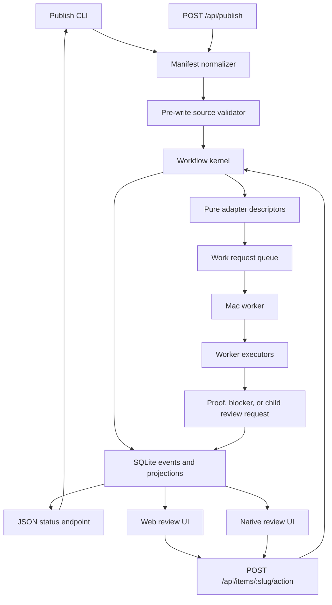
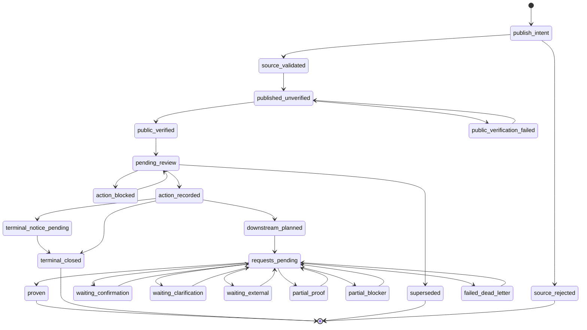
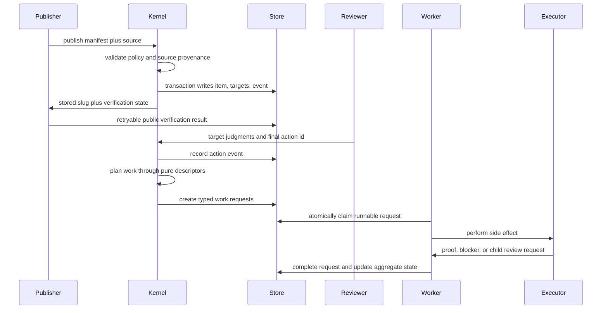

# feat: Build a review workflow kernel

## Goal Capsule

| Field | Value |
|---|---|
| Objective | Rebuild Turf Review around a typed workflow kernel that owns publishing, provenance, final actions, downstream requests, proof, and review surface parity. |
| Target repo | `turfterrace-review` |
| Companion repo | `clawd`, for the operator publish wrapper and Turf Terrace runbook updates. |
| Execution profile | Deep, cross-cutting software plan. The work changes API contracts, persistence, worker behavior, web UI, native UI, and operator tooling. |
| Authority hierarchy | Preserve the current product contract first; make shell scripts, server routes, and worker code consumers of the new kernel second; defer cosmetic UI changes unless needed to expose workflow truth. |
| Stop conditions | Stop if the new model cannot preserve existing pending items, if worker side effects cannot produce durable proof, or if source provenance becomes weaker than the current git-backed contract. |
| Tail ownership | Land this as a staged migration with compatibility tests before old publish and action paths are removed. |

---

## Product Contract

### Summary

Turf Review should become a typed approval and execution system, not a set of publish scripts, route handlers, and conventions.
The promise stays simple: publish a reviewable artifact, let Jimmy act on it, then turn that action into a durable downstream outcome or a visible blocker.
The new system makes that promise explicit in code.

This revision folds in the external review findings.
The plan now splits pure planning from side effects, models fan-out and failure, narrows target extraction, moves migration earlier, separates pre-write validation from public verification, and adds SQLite concurrency rules.

### Problem Frame

The current system has the right product instincts but weak boundaries.
The publish wrapper validates some source rules, the server validates other rules, docs describe more rules, and the worker converts actions into side effects.
That spread makes the system hard to reason about when a review item does more than record a simple response.

The best version from scratch uses one workflow kernel.
Every surface asks the kernel the same questions: what can this item do, what state is it in, what must happen before a final action, which downstream planner owns the next request, which executor may run a side effect, and what proof closes the loop.

### Items to review

- [ ] Approve the kernel-first rebuild as the right direction instead of incremental publish-script hardening.
- [ ] Keep git-backed source provenance as a hard publish requirement for normal reviews.
- [ ] Make the publish CLI JavaScript-owned and demote shell scripts to compatibility wrappers.
- [ ] Treat web and native review surfaces as equal consumers of the same API contracts.
- [ ] Include migration tooling for existing pending and archived items in the first implementation wave.

### Requirements

**Review artifact and source contract**

- R1. A published review item has a typed manifest that declares title, category, artifact kind, source path, workspace, targets, sensitivity, action ids, and post-action intent.
- R2. Normal publishes require source provenance that resolves to a git-tracked source file inside a declared workspace.
- R3. Generated artifacts can use explicit provenance exemptions, but each exemption must name its generator, owner, source artifact, and replay command when one exists.
- R4. Markdown, custom HTML, and future artifact kinds share one publish lifecycle without pretending all content is Markdown.
- R5. Re-publishing the same title and content returns the existing item unless the caller asks for a replacement review.
- R6. Custom HTML renders in an isolated origin or sandbox and cannot read parent app cookies, auth tokens, local storage, or privileged APIs.

**Policy and final actions**

- R7. Categories, allowed actions, target gating rules, feedback requirements, and terminal statuses come from one shared policy module.
- R8. Custom action labels are not accepted unless policy defines them.
- R9. Web and native clients post server-provided action ids, not display labels; the server rejects stale ids and client-invented labels.
- R10. Positive document-level actions are blocked while required targets remain undecided.
- R11. Rework-style actions require feedback from either global feedback or rejected-target feedback.
- R12. Terminal actions archive, park, kill, or dismiss without creating hidden downstream work.
- R13. Terminal actions still create an origin-session notice when the manifest includes origin-session context.

**Lifecycle and audit**

- R14. Every review item moves through a finite lifecycle from publish intent through source validation, stored publication, public verification, pending review, recorded action, fan-out, proof, blocker, failure, supersession, or terminal close.
- R15. State changes append durable events that include actor, source, transition, payload summary, proof reference, and provenance such as `live` or `migrated`.
- R16. The current-state projection and the event append happen in one SQLite transaction.
- R17. Public URL verification is a post-write publication stage with explicit success or failure state, not an optional log line.
- R18. SSE and notifications are delivery signals only; they never count as completion proof.

**Targets and annotations**

- R19. Explicit manifest targets are authoritative when present.
- R20. Markdown task-list shorthand is extracted only from designated target sections such as `Items to review`; task lists under requirements, acceptance examples, implementation units, or done criteria are never targets.
- R21. Target judgments, annotations, chat, and final actions travel in one compact context packet without conflating their storage models.
- R22. Target judgments remain structured evidence for the final action, not independent task triggers.

**Downstream action routing**

- R23. Each non-terminal action becomes one or more typed work requests planned by a pure adapter descriptor.
- R24. Side effects run only in worker executors, never inside kernel planners or route handlers.
- R25. Each adapter descriptor declares input schema, sensitivity, idempotency scope, retry policy, proof schema, blocker schema, fan-out behavior, and terminal no-op behavior.
- R26. A parent action can fan out to several requests and completes only when aggregation rules mark all required branches proven, terminal, or intentionally blocked.
- R27. Sensitive send or calendar work creates a confirmation review before the side effect runs, then resumes exactly one parent request after approval.
- R28. Missing detail creates a clarification review before the downstream request continues.
- R29. Software build plans route to agent build work through an explicit manifest or policy match, not only through title and body heuristics.
- R30. Idempotency keys are stable for the same action event across retries and unique for a later action after new feedback, changed targets, or replacement review state.

**Reader and operator surfaces**

- R31. The web app, native app, CLI, worker, and review APIs all consume the same policy and lifecycle contracts.
- R32. Review pages show action availability, target completion, downstream status, blockers, failure state, retry state, and proof in one place.
- R33. The native app can render the same action ids, target state, artifact type, and downstream status as the web app.
- R34. The operator CLI can publish, verify, inspect, retry, and diagnose review items without hand-written curl flows.
- R35. A JSON status endpoint reports publication, public verification, target extraction, action policy, work requests, and proof state so tooling does not scrape HTML.

### Acceptance Examples

- AE1. Given a Markdown plan with five `Items to review`, when it is published, then the review item stores five required targets, verifies source provenance, writes a stored-publication event, and exposes canonical `general` action ids.
- AE2. Given a task list under acceptance examples, when the plan is published, then that task list does not create review targets.
- AE3. Given one required target remains undecided, when Jimmy chooses `Execute`, then the server rejects the action, leaves the item pending, and returns a target summary.
- AE4. Given all targets are resolved and Jimmy chooses `Execute`, when the item manifest marks it as a software plan, then the kernel creates an `agent_build` work request with source provenance, review URL, target judgments, feedback, and origin-session context.
- AE5. Given one action fans out to build work and an origin-session notice, when the notice succeeds and the build is still running, then the parent item shows partial proof rather than complete proof.
- AE6. Given a downstream request needs a calendar time but no exact slot exists, when the descriptor plans the action, then the kernel records a blocked work request and creates a clarification review.
- AE7. Given a sensitive outbound send request, when the descriptor detects send semantics, then it creates a confirmation review and no executor sends until Jimmy approves that confirmation.
- AE8. Given the worker completes an OmniFocus request, when it reports the task id, then the request stores proof and the review shows the authoritative task id.
- AE9. Given a notification is delivered but the parent work lacks proof, when the worker reports success for the notification request, then only the notification branch is proven.
- AE10. Given public verification fails after the item row is written, when the CLI exits, then the item remains in `published_unverified` with a retryable verification failure visible in the JSON status endpoint.
- AE11. Given a legacy item lacks source provenance, when migration audit runs, then it either maps the item to a git-backed review-doc source or marks it legacy-readonly with no execution path.

### Scope Boundaries

#### In Scope

- A shared workflow kernel for policy, manifests, source provenance, lifecycle transitions, target gating, action planning, proof aggregation, and diagnosis.
- Server routes that delegate publish and final-action behavior to the kernel.
- A JavaScript publish CLI that replaces shell-owned validation and reports public verification through a JSON status endpoint.
- Pure adapter descriptors for OpenClaw build, OmniFocus, outreach, calendar, notifications, and origin-session notices.
- Worker executors for current side-effect systems: OpenClaw build, OmniFocus, outreach confirmation, calendar clarification, notifications, and origin-session notices.
- Web and native contract updates needed to show the same action ids, targets, artifact metadata, downstream state, blockers, failure, and proof.
- Migration audit and apply tooling for current review rows and existing source provenance.

#### Deferred to Follow-Up Work

- A full visual redesign of the web or native reader.
- Remote live website capture as a review artifact source.
- Multi-user roles beyond the current Jimmy/operator actor model.
- Analytics dashboards over review outcomes.
- Replacing SQLite with a network database.
- Generalizing Turf Review into a public product.

#### Outside This Product's Identity

- Treating Turf Review as a task manager. OmniFocus remains the task system.
- Treating chat, annotations, SSE, or notification delivery as authoritative completion proof.
- Letting arbitrary published HTML share the parent app origin.
- Letting agents bypass review for sensitive external sends, calendar commitments, or account-changing actions.

---

## Planning Contract

### Key Technical Choices

- KTD1. Build a kernel package inside `lib/reviews/kernel/`. The kernel owns policy, lifecycle validation, manifests, provenance, target rules, action planning, projection, and view-model shaping.
- KTD2. Keep the kernel pure. It returns descriptors and transition intents; it does not call OpenClaw, OmniFocus, mail, calendar, notification, network, or shell APIs.
- KTD3. Use a manifest-first publish contract. Markdown frontmatter, explicit JSON payloads, or CLI flags normalize into one `ReviewManifest` shape before any database write.
- KTD4. Keep source provenance mandatory for normal publishes. A weaker fallback would make review items easier to create but harder to trust, retry, republish, and execute.
- KTD5. Use append-only events plus current-state projection. Current columns keep fast queue reads, but event rows explain how the item reached its state.
- KTD6. Wrap each event append and projection update in one SQLite transaction. Enable WAL and set `busy_timeout` for server and worker processes.
- KTD7. Split adapter descriptors from worker executors. Descriptors plan requests and schemas; executors perform side effects and return proof or blockers.
- KTD8. Treat shell scripts as compatibility wrappers. The canonical publisher is a tested JavaScript CLI that imports the same modules as the server.
- KTD9. Preserve schema v3 compatibility while migrating. Existing pending and archived items keep rendering and acting during the transition.
- KTD10. Make native parity contract-level. Native receives server action ids and view models rather than reimplementing action policy in Swift.
- KTD11. Verify published items through a JSON status endpoint, not by scraping review page HTML.

### High-Level Technical Design







### Proposed Output Structure

```text
lib/reviews/kernel/
  action-policy.js
  artifact-policy.js
  concurrency.js
  context-packet.js
  events.js
  lifecycle.js
  manifest.js
  migrations.js
  provenance.js
  publish.js
  publish-status.js
  requests.js
  targets.js
  transitions.js
  view-models.js
  adapter-descriptors/
    calendar.js
    notifications.js
    omnifocus.js
    openclaw-build.js
    origin-session.js
    outreach.js
lib/reviews/executors/
  calendar.js
  notifications.js
  omnifocus.js
  openclaw-build.js
  origin-session.js
  outreach.js
scripts/
  turf-review.js
  migrate-review-kernel.js
test/
  kernel-action-policy.test.js
  kernel-concurrency.test.js
  kernel-descriptors.test.js
  kernel-executors.test.js
  kernel-lifecycle.test.js
  kernel-manifest.test.js
  kernel-migration.test.js
  kernel-provenance.test.js
  kernel-publish.test.js
  kernel-requests.test.js
  kernel-targets.test.js
  kernel-view-models.test.js
```

The tree names the ownership boundaries.
Implementation may fold small modules together if tests still prove the same contracts.

### Assumptions

- SQLite remains the local production database for this rebuild.
- Server and worker can write concurrently, so WAL, `busy_timeout`, and short transactions are mandatory.
- Production remains `https://review.turfterrace.com`, with local `TURF_REVIEW_WEB_ONLY=1` reserved for development or fallback.
- OpenClaw remains the build and execution bridge for software plans.
- The native app can accept API additions without a full UI redesign.
- Current custom HTML artifact support remains in scope, but remote live capture does not.
- Production smoke should not add noise to the live queue. CI uses local or staging publishes; production publish proof stays a deliberate operator step.

### System-Wide Impact

- Publish behavior moves from shell-first to library-first.
- The server, worker, CLI, web page, and native app stop carrying their own copies of policy.
- Review items gain a stronger audit trail, which makes retry and diagnosis safer.
- Pending items need a migration path before old routes are removed.
- Documentation in `README.md`, `ARCHITECTURE.md`, and the companion `clawd` runbook must change together or old conventions will leak back.

### Risks and Mitigations

| Risk | Mitigation |
|---|---|
| The rewrite becomes too broad. | Land the kernel behind existing API routes first, then switch surfaces one by one. |
| Migration breaks existing pending reviews. | Run a read-only migration audit before lifecycle writes, keep dual-read compare mode, and apply migration only after route compatibility tests pass. |
| Adapter proof contracts stay vague. | Require each descriptor to declare proof and blocker schemas and require each executor test to return those shapes. |
| Planner code performs side effects. | Keep descriptors under `lib/reviews/kernel/adapter-descriptors/` and side effects under `lib/reviews/executors/`; add tests that descriptors run without side-effect clients. |
| Target extraction keeps over-matching plans. | Make explicit manifest targets authoritative and limit Markdown shorthand to designated target sections, with negative fixtures for requirements and done criteria. |
| Server and worker corrupt projection state under concurrent writes. | Use WAL, `busy_timeout`, atomic event/projection transactions, and a reconciliation doctor that compares projection state with event replay. |
| Native app drifts from web behavior. | Add policy and view-model API responses that Swift renders directly, including server action ids. |
| Shell compatibility hides new errors. | Keep wrappers thin and emit the JavaScript CLI's structured error output unchanged. |
| Public verification fails during Cloudflare or tunnel outages. | Record `public_verification_failed`, expose it through status JSON, and let the CLI retry verification without duplicating the review item. |

---

## Implementation Units

### U1. Define shared policy and manifest contracts

- **Goal:** Create the typed contracts that all publish and action paths consume.
- **Requirements:** R1, R4, R7, R8, R9, R29, R31
- **Dependencies:** none
- **Files:** `lib/reviews/kernel/action-policy.js`, `lib/reviews/kernel/manifest.js`, `lib/reviews/kernel/artifact-policy.js`, `lib/review-routing.js`, `test/kernel-manifest.test.js`, `test/kernel-action-policy.test.js`, `test/review-routing.test.js`, `README.md`
- **Approach:** Move canonical category actions, routed action sets, target gating rules, feedback requirements, artifact type rules, server action ids, and software-plan detection into kernel modules. Keep `lib/review-routing.js` as a compatibility export until callers migrate.
- **Patterns to follow:** Preserve the current category mapping in `lib/review-routing.js` and the artifact classification split in `lib/reviews/artifacts.js`.
- **Test scenarios:**
  - A `general` manifest resolves to stable action ids for `Noted`, `Execute`, `Inbox`, `Rework`, and `Kill`.
  - A supplied action array that differs by label, order, id, or length fails validation.
  - A client that posts a label instead of an action id fails with a stale-policy error.
  - A Markdown source resolves to artifact kind `markdown`; an HTML source resolves to `custom_html`.
  - A software build plan with an explicit marker resolves to an `agent_build` intent.
  - A title-only software heuristic does not route unless body or manifest evidence supports it.
  - Existing `getCanonicalActions` and `isAllowedDecision` compatibility exports return the same values as before.
- **Verification:** All callers can ask the kernel for category actions and artifact policy without importing route-specific code.

### U2. Audit current rows before schema writes

- **Goal:** Know how existing items map into the new model before adding lifecycle state.
- **Requirements:** R2, R3, R11, R14, R15, R34
- **Dependencies:** U1
- **Files:** `lib/reviews/kernel/migrations.js`, `scripts/migrate-review-kernel.js`, `test/kernel-migration.test.js`, `scripts/pending-item-migration.json`
- **Approach:** Add a read-only audit mode that classifies every current row by source provenance, artifact type, target state, current action state, expected lifecycle state, unsupported gaps, and proposed migration path. It writes no item state. It emits a report operators can inspect before applying migration.
- **Patterns to follow:** Use the existing pending-item migration config as precedent, but make this audit exhaustive and idempotent.
- **Test scenarios:**
  - A schema v3 Markdown item with source provenance maps to executable kernel state.
  - A custom HTML item preserves artifact metadata and source path.
  - A legacy item without source provenance maps to `legacy_readonly` unless config supplies a git-backed source.
  - A mid-flight item with queued work maps to pending aggregate state without closing it.
  - Audit mode reports every item category, blocked reason, and proposed action without writing state.
  - Running audit twice returns the same classification for unchanged input.
- **Verification:** Operators can see migration risk before kernel lifecycle writes exist.

### U3. Build source validation and publish status

- **Goal:** Split pre-write source validation from post-write public verification.
- **Requirements:** R2, R3, R5, R6, R17, R35
- **Dependencies:** U1, U2
- **Files:** `lib/reviews/kernel/provenance.js`, `lib/reviews/source-paths.js`, `lib/reviews/artifacts.js`, `lib/reviews/kernel/publish.js`, `lib/reviews/kernel/publish-status.js`, `test/kernel-provenance.test.js`, `test/source-paths.test.js`, `test/artifacts.test.js`, `test/kernel-publish.test.js`
- **Approach:** Wrap existing git-tracked source checks in a provenance result that records strength, git root, relative source path, exemption reason, and failure mode. Pre-write validation rejects bad source state before any database write. Post-write public verification updates publication state and reports through status JSON. Custom HTML validation also proves asset containment and isolated rendering mode.
- **Patterns to follow:** Reuse `resolveGitTrackedSource` and custom HTML asset containment rules instead of duplicating path checks.
- **Test scenarios:**
  - A tracked file inside the workspace returns provenance strength `git_tracked`.
  - An untracked file fails with a `source_not_tracked` code and a user-facing fix hint.
  - A generated exemption succeeds only when generator id, owner, and artifact source are present.
  - A source outside the workspace fails before any publish write.
  - A custom HTML artifact fails if it requires parent-origin privileges or unsafe asset paths.
  - Post-write public verification failure stores `public_verification_failed` and keeps the slug retryable.
  - The status endpoint reports source provenance, public verification state, target count, action ids, work request summary, and proof summary.
- **Verification:** Publish pre-write checks and post-write verification produce structured results that CLI and API display without parsing stderr or scraping HTML.

### U4. Add lifecycle events and current-state projection

- **Goal:** Make review item state transitions auditable, enforceable, and concurrency-safe.
- **Requirements:** R14, R15, R16, R18, R26, R30
- **Dependencies:** U1, U2, U3
- **Files:** `lib/db.js`, `lib/reviews/repository.js`, `lib/reviews/kernel/concurrency.js`, `lib/reviews/kernel/events.js`, `lib/reviews/kernel/lifecycle.js`, `lib/reviews/kernel/transitions.js`, `test/kernel-lifecycle.test.js`, `test/kernel-concurrency.test.js`, `test/decision-actions.test.js`
- **Approach:** Add `review_events` as an append-only table and keep existing item status columns as projections. The kernel is the only module that writes lifecycle transitions. Each event append and projection write happens inside one transaction. Add WAL setup, `busy_timeout`, and an event-replay reconciliation helper.
- **Patterns to follow:** Use the additive migration style in `lib/db.js` and prepared statement grouping in `lib/reviews/repository.js`.
- **Test scenarios:**
  - Publishing writes `publish_intent`, `source_validated`, `published_unverified`, and `public_verified` events in order when verification succeeds.
  - Public verification failure leaves the item retryable and does not report a clean publish.
  - A valid final action writes an action event and projects item state to terminal, downstream pending, partial proof, blocked, failed, or proven.
  - A no-op terminal action with origin context creates an origin notice request and then terminal close.
  - Fan-out aggregation keeps the parent item open until all required child requests are proven, terminal, or intentionally blocked.
  - An invalid transition, such as acting on a superseded item, fails without appending an event.
  - SSE notification events do not satisfy proof or completion states.
  - Event replay can reconstruct the current item state for publish, action, fan-out, proof, and failure paths.
  - Two concurrent worker completions cannot produce a projection that disagrees with event replay.
- **Verification:** A review item page and doctor command can explain how an item reached its visible state from event rows.

### U5. Normalize item judgments and context packets

- **Goal:** Make targets first-class manifest/context data while fixing Markdown shorthand extraction.
- **Requirements:** R10, R11, R19, R20, R21, R22
- **Dependencies:** U1, U4
- **Files:** `lib/reviews/kernel/targets.js`, `lib/reviews/review-targets.js`, `lib/chat/openclaw-context.js`, `lib/reviews/decision-contract.js`, `server.js`, `test/kernel-targets.test.js`, `test/kernel-view-models.test.js`, `test/review-targets.test.js`, `test/chat-context.test.js`, `test/decision-contract.test.js`
- **Approach:** Let manifests supply explicit target IDs and labels. Use Markdown task-list extraction only inside designated target sections. Build a context packet function that returns targets, annotations, feedback, source, artifact metadata, review URL, and origin-session data in one compact shape for chat, descriptors, and executors.
- **Patterns to follow:** Preserve current verdict normalization and the existing image-data compaction rule in chat context.
- **Test scenarios:**
  - Explicit manifest targets keep stable IDs even if label text changes.
  - Markdown task-list targets extract only from `Items to review`.
  - Task lists under requirements, acceptance examples, implementation units, or done criteria do not create targets.
  - Rejected-target feedback satisfies `Rework` when global feedback is empty.
  - Positive actions reject incomplete required targets.
  - Optional targets do not block positive actions.
  - Context packets include annotations and target judgments without raw image data.
- **Verification:** Chat, action planning, and worker requests all consume the same context packet.

### U6. Define adapter descriptors and proof schemas

- **Goal:** Route each non-terminal action through pure planners with explicit proof, blocker, and idempotency contracts.
- **Requirements:** R23, R25, R26, R27, R28, R29, R30
- **Dependencies:** U1, U4, U5
- **Files:** `lib/reviews/kernel/adapter-descriptors/openclaw-build.js`, `lib/reviews/kernel/adapter-descriptors/omnifocus.js`, `lib/reviews/kernel/adapter-descriptors/outreach.js`, `lib/reviews/kernel/adapter-descriptors/calendar.js`, `lib/reviews/kernel/adapter-descriptors/notifications.js`, `lib/reviews/kernel/adapter-descriptors/origin-session.js`, `lib/reviews/kernel/requests.js`, `test/kernel-descriptors.test.js`, `test/kernel-requests.test.js`
- **Approach:** Convert current decomposition into policy-to-descriptor planning. Each descriptor returns normalized work requests and declares input schema, proof schema, blocker schema, retry policy, aggregation role, and idempotency scope. Descriptors do not import side-effect clients or perform I/O.
- **Patterns to follow:** Preserve existing `agent_build`, `create_omnifocus_task`, confirmation review, clarification review, and origin-session behavior from `decision-contract.js` and `orchestrator.js`.
- **Test scenarios:**
  - `Inbox` creates one OmniFocus work request with review URL and feedback in the payload.
  - `Execute` on an explicit software plan creates one OpenClaw build work request.
  - `Execute` with feedback that asks to send a message creates a sensitive confirmation child review.
  - Calendar-like feedback without exact time creates a clarification child review.
  - `Noted`, `Park`, `No further action`, and `Kill` create no side-effect request except an origin-session notice when origin context exists.
  - Notification proof satisfies only the notification branch and never the parent work item.
  - Idempotency keys stay stable across retries for the same action event and differ for a later action event.
  - Descriptor tests run with side-effect clients unavailable.
- **Verification:** Action routing can be understood from descriptor declarations without reading route handlers or worker executors.

### U7. Delegate server routes to the kernel

- **Goal:** Move API rule ownership into kernel modules while preserving endpoint URLs.
- **Requirements:** R14, R23, R26, R31, R32, R34, R35
- **Dependencies:** U3, U4, U5, U6
- **Files:** `server.js`, `lib/reviews/repository.js`, `lib/reviews/kernel/publish-status.js`, `test/decision-actions.test.js`, `test/kernel-requests.test.js`, `test/kernel-publish.test.js`
- **Approach:** Route `POST /api/publish`, target judgment updates, final actions, retry, status, and inspect endpoints through kernel functions. Replace direct state mutation in route handlers with transition calls. Keep existing URLs and response fields where current clients depend on them.
- **Patterns to follow:** Preserve current publish, target update, decide, retry, and detail endpoint behavior while adding enriched fields.
- **Test scenarios:**
  - Publishing through the API writes the same item shape current clients expect plus event rows.
  - The API rejects stale action ids and client-invented labels.
  - Acting on a pending item returns downstream request summaries and follow-up review URLs.
  - Retrying a failed request appends a retry event and moves the request back to runnable state.
  - The status endpoint reports publication, verification, targets, policy, work requests, proof, blockers, and failure state.
  - Existing API consumers keep working while server-side rule ownership moves into the kernel.
- **Verification:** Server routes become adapters over the workflow kernel rather than separate policy implementations.

### U8. Move worker I/O into executors

- **Goal:** Make the Mac worker a side-effect runner that consumes typed work requests and writes proof through lifecycle transitions.
- **Requirements:** R24, R25, R26, R27, R28, R30
- **Dependencies:** U4, U6, U7
- **Files:** `scripts/mac-worker.js`, `lib/reviews/executors/openclaw-build.js`, `lib/reviews/executors/omnifocus.js`, `lib/reviews/executors/outreach.js`, `lib/reviews/executors/calendar.js`, `lib/reviews/executors/notifications.js`, `lib/reviews/executors/origin-session.js`, `lib/reviews/orchestrator.js`, `test/kernel-executors.test.js`, `test/decision-orchestrator.test.js`
- **Approach:** Keep the worker claim and completion endpoints stable. Move side-effect execution into executor modules that accept typed requests and return proof, blocker, retry, or child-review intents. Worker completion updates aggregate parent state through the kernel.
- **Patterns to follow:** Preserve current worker claim and completion contracts so launchd and remote worker flows do not break.
- **Test scenarios:**
  - Worker claim skips blocked, waiting-confirmation, and waiting-external requests until their recheck window.
  - Worker completion with valid proof moves the request to succeeded and updates the parent aggregate state.
  - Worker completion with a blocker moves the branch to blocked and exposes the blocker reason.
  - Worker completion with child requests creates confirmation or clarification reviews when required.
  - Approving a confirmation child review resumes exactly one parent request and cannot duplicate the side effect if the approval is retried.
  - Retry uses the same idempotency key for the same action event.
  - A duplicate completion cannot double-run or double-count proof.
- **Verification:** The worker can claim a synthetic request, complete it with proof, and leave blocked or failed requests visible when proof is missing.

### U9. Expose workflow truth in web and native readers

- **Goal:** Give reviewers the same policy, target, artifact, downstream, failure, and proof state on every surface.
- **Requirements:** R9, R31, R32, R33, R35
- **Dependencies:** U4, U5, U6, U7
- **Files:** `lib/reviews/kernel/view-models.js`, `views/review.ejs`, `public/review-targets.js`, `public/styles.css`, `TurfReviewNative/TurfReviewNative/Models/TurfModels.swift`, `TurfReviewNative/TurfReviewNative/Services/TurfReviewClient.swift`, `TurfReviewNative/TurfReviewNative/Views/DecisionDock.swift`, `TurfReviewNative/TurfReviewNative/Views/ReviewDetailView.swift`, `test/kernel-view-models.test.js`
- **Approach:** Add review detail view-model endpoints that include action ids, labels, disabled reasons, target summaries, artifact kind, downstream state, latest proof, retry availability, failure state, public verification state, and follow-up review links. Web and native render that shape rather than re-deriving rules.
- **Patterns to follow:** Preserve the existing web sidebar target panel and native decision dock, but source enabled and disabled states from the API.
- **Test scenarios:**
  - A review with undecided targets returns `Execute` as disabled with a target-completion reason.
  - A native client posts the server action id and succeeds; posting the label fails.
  - A review with a failed downstream request returns retry availability and latest error.
  - A proven OmniFocus request returns the task proof in the decided review view.
  - A custom HTML item returns artifact metadata without exposing raw HTML in list responses.
  - Custom HTML renders isolated from parent-origin privileges.
  - Swift decoding accepts the new fields while older server responses still render with defaults.
  - Web rendering shows read-only target and proof state after the item leaves pending.
- **Verification:** A reviewer can understand why an action is available, blocked, queued, failed, or proven without inspecting raw API JSON.

### U10. Ship a canonical JavaScript CLI

- **Goal:** Replace shell-owned publishing rules with a tested operator CLI and thin wrappers.
- **Requirements:** R1, R2, R5, R17, R34, R35
- **Dependencies:** U1, U3, U4, U7
- **Files:** `scripts/turf-review.js`, `publish-review.sh`, `test/kernel-publish.test.js`, `README.md`, companion `clawd/scripts/publish-review.sh`, companion `clawd/scripts/validate-review-source.ts`, companion `clawd/tools/TURFTERRACE.md`
- **Approach:** Add `node scripts/turf-review.js publish <source> --title <title> --category <category>` plus `inspect`, `retry`, `doctor`, and `verify-url` subcommands. Make both shell scripts call the CLI and preserve current flags where practical.
- **Patterns to follow:** Preserve current auth loading behavior from the shell wrapper and current source-provenance expectations from `TURFTERRACE.md`.
- **Test scenarios:**
  - CLI publish rejects an invalid category before any network call.
  - CLI publish accepts Markdown and HTML sources through the same manifest normalizer.
  - CLI publish displays an existing slug when the server returns `deduped`.
  - CLI doctor reports source provenance, public verification, targets, actions, work requests, and proof state.
  - CLI verify uses the status endpoint rather than review page HTML.
  - Shell wrapper passes legacy arguments through to the CLI without changing category action behavior.
  - Missing auth fails with a clear message and no partial publish.
- **Verification:** Operators can publish and diagnose reviews without curl or shell-specific validation logic.

### U11. Apply migration and retire legacy rule sources

- **Goal:** Move current items and docs onto the kernel without losing pending work or preserving stale rule copies.
- **Requirements:** R14, R15, R16, R31, R34
- **Dependencies:** U2, U4, U7, U8, U9, U10
- **Files:** `scripts/migrate-review-kernel.js`, `scripts/pending-item-migration.json`, `README.md`, `BRIEF.md`, `ARCHITECTURE.md`, `test/kernel-migration.test.js`, `test/kernel-lifecycle.test.js`, companion `clawd/tools/TURFTERRACE.md`
- **Approach:** Add apply mode only after dry-run audit is stable. Apply mode writes `provenance: migrated` events, records an idempotent migration marker per item, and supports rollback from a backup snapshot. Run dual-read compare mode before kernel-primary mode. Mark unsupported legacy items read-only with reasons.
- **Patterns to follow:** Use additive migrations in `lib/db.js`; do not rewrite historical rows without backup.
- **Test scenarios:**
  - A current schema v3 Markdown item with source provenance migrates to kernel events and remains executable.
  - A custom HTML item preserves artifact metadata, source path, and isolated rendering policy.
  - A legacy item without source provenance becomes read-only unless mapped by config.
  - A mid-flight item with queued or blocked work keeps its aggregate state after migration.
  - Migration writes an item-level marker with source schema, target schema, checksum, and timestamp.
  - Running apply mode twice is idempotent.
  - Dual-read compare mode reports projection drift without switching writes.
  - Rollback restores the pre-apply backup for item, request, target, and event tables.
  - Stale documentation references to schema v2 and legacy listeners are removed or clearly marked historical.
- **Verification:** Existing queue behavior survives migration, and new docs point operators at the kernel CLI and doctor flow.

---

## Verification Contract

| Gate | Applies to | Done signal |
|---|---|---|
| `npx -y node@22 --test` | Full server, kernel, and worker test suite while local `better-sqlite3` ABI drift is possible. | All Node tests pass under Node 22. |
| `npm test` | Standard repo test command once local Node matches installed native modules. | The package test script passes without ABI errors. |
| Focused kernel tests | U1 through U10. | New `test/kernel-*.test.js` files pass and prove policy, manifest, provenance, lifecycle, concurrency, descriptor, executor, request, publish, target, migration, and view-model contracts. |
| Target extraction fixtures | U5. | This plan and negative fixtures extract only intended target sections; requirements, acceptance examples, implementation units, and done criteria create zero accidental targets. |
| API smoke | U7 through U9. | Local `TURF_REVIEW_WEB_ONLY=1` server can publish, render, act, block, retry, inspect, and verify a review item without executing downstream side effects. |
| Worker smoke | U6 through U8. | Mac worker can claim a synthetic request, complete it with proof, and leave blocked requests visible when proof is missing. |
| Publish status smoke | U3, U7, U10. | A git-tracked Markdown plan publishes locally or to staging and the doctor command verifies title, action ids, targets, source provenance, and public verification through status JSON. |
| Production publish proof | U10, U11. | An operator-run production publish succeeds without polluting CI and the prior review item is superseded or killed deliberately. |
| Native decode smoke | U9. | Native app decodes the enriched item detail payload, posts action ids, and preserves current queue and detail behavior. |
| Migration dry-run | U2. | Migration report classifies all existing items and writes no state. |
| Migration apply rehearsal | U11. | Backup, apply, dual-read compare, and rollback all work on a copied production database. |
| Concurrency stress | U4, U8. | Parallel server and worker writes leave event replay and current projection in agreement. |

---

## Definition of Done

- The kernel owns category policy, manifest validation, source provenance, lifecycle transitions, target gating, action planning, aggregation, and view-model generation.
- Adapter descriptors are pure planners; worker executors own side effects.
- Existing public API URLs remain compatible unless this plan explicitly names a replacement.
- `publish-review.sh` wrappers call the JavaScript CLI or clearly mark themselves as deprecated compatibility shims.
- A new review can be published, publicly verified, target-decided, executed, and proven without any handwritten curl command.
- Public verification failures are visible, retryable, and reported through JSON status.
- Target extraction accepts explicit manifest targets and designated target sections only.
- Terminal and no-action flows close without hidden downstream work, except explicit origin-session notice branches.
- Fan-out actions show partial proof, blockers, failed branches, retries, and final aggregate state.
- Notification delivery never proves unrelated parent work.
- Sensitive send and calendar work requires confirmation or clarification before side effects.
- SQLite writes use WAL, `busy_timeout`, and atomic event/projection transactions.
- Existing pending review items either migrate into kernel state or become visible read-only legacy items with a documented reason.
- Web and native review surfaces render the same action ids, disabled reasons, target summaries, artifact kind, downstream status, failure state, and proof.
- Custom HTML remains isolated from parent-origin privileges.
- Documentation names one canonical workflow and removes stale schema v2 or retired listener instructions.
- Abandoned exploratory code from the migration is removed before landing.

---

## Sources and Research

- `README.md` defines the current model: category-driven actions, git-backed publishes, targets, software build plan routing, confirmation reviews, clarification reviews, proof, and retry visibility.
- `lib/review-routing.js` is the current source for schema v3, canonical actions, routed actions, and terminal status mapping.
- `lib/reviews/decision-contract.js` shows current decomposition, feedback parsing, software-plan detection, and origin-session notice behavior.
- `lib/reviews/orchestrator.js` and `scripts/mac-worker.js` show the current work request queue, confirmation and clarification follow-ups, OpenClaw build path, OmniFocus path, retry behavior, and proof handling.
- `lib/reviews/source-paths.js` and `lib/reviews/artifacts.js` show current source-provenance and custom HTML artifact safety checks.
- `lib/reviews/review-targets.js`, `public/review-targets.js`, and `views/review.ejs` show current target extraction and web target rendering behavior.
- `docs/plans/2026-06-12-001-feat-native-review-target-approvals-plan.md` establishes the target judgment contract.
- `docs/plans/2026-06-30-turf-review-web-items-custom-html-plan.md` establishes web target and custom HTML artifact constraints.
- Companion `clawd/tools/TURFTERRACE.md` defines the operator rulebook: production URL, source provenance, default review surface, canonical actions, and downstream completion contract.
