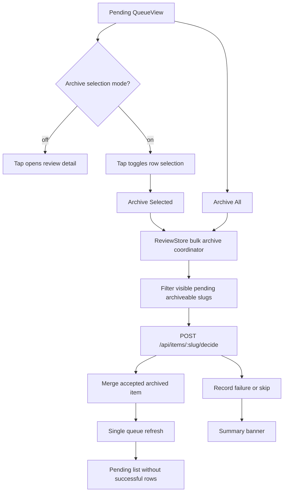

# Native Bulk Archive - Plan

## Goal Capsule

| Field | Value |
|---|---|
| Objective | Add pending-queue Archive All and multi-select archive support to Turf Review Native on iPhone and iPad. |
| Target repo | `turfterrace-review` |
| Execution profile | Standard native feature plan. The work changes SwiftUI queue controls, store decision orchestration, client-facing state, and native tests. |
| Authority hierarchy | Preserve the current decision contract first; keep native queue ergonomics second; defer backend batch routes unless native orchestration cannot stay reliable. |
| Stop conditions | Stop if archive would bypass `/api/items/:slug/decide`, touch non-pending rows, hide partial failures, or make compact navigation regress. |
| Tail ownership | Finish with simulator tests and a physical iPhone or iPad smoke pass because recent native queue issues only reproduced on device-class layouts. |

---

## Product Contract

### Summary

Turf Review Native should let Jimmy clear low-value pending reviews without swiping every row.
Archive All archives every visible pending review that has a terminal no-action archive decision.
Multi-select archive lets him choose several pending rows, then archive only those rows.
Both commands use the same server decision contract as the current swipe archive path.

### Problem Frame

The pending queue already supports swipe-to-archive one item at a time through `ReviewItem.archiveAction` and `ReviewStore.submitDecision`.
That is enough for one-off cleanup, but it is slow when the queue contains many low-value items.
The native app needs bulk archive controls that stay explicit, reversible at the review step, and honest about partial failures.

### Items to review

- [ ] Archive All means all currently visible pending items, not parked or decided rows.
- [ ] Bulk archive should submit each item's canonical terminal decision through `/api/items/:slug/decide`, not `/api/items/:slug/dismiss`.
- [ ] Partial success is acceptable: archive successful rows, keep failed or skipped rows visible, and show a summary.

### Requirements

**Bulk archive behavior**

- R1. The pending queue exposes Archive All when at least one visible pending row has an archive action.
- R2. Archive All archives every visible pending item with an archive action and skips rows that lack one.
- R3. Multi-select mode lets Jimmy select and unselect pending rows before archiving only the selected archiveable rows.
- R4. Bulk archive never acts on parked, decided, killed, dismissed, or otherwise non-pending rows.

**Decision contract and state**

- R5. Each archived row uses its canonical no-action decision and action id through the existing decision endpoint.
- R6. Bulk archive submits no feedback and creates no hidden downstream request for terminal no-action decisions.
- R7. The store prevents duplicate submissions for the same slug while bulk archive is running.
- R8. Successful rows leave the visible pending list promptly, even if the final refresh fails.
- R9. Failed or skipped rows stay pending and are named or counted in a visible banner.

**Native UX**

- R10. Normal queue navigation keeps working when selection mode is off.
- R11. Selection mode changes row taps into checkbox toggles and does not push compact navigation routes.
- R12. The UI disables destructive bulk controls while a bulk archive is running.
- R13. Empty, demo, compact iPhone, and regular iPad layouts all keep stable row height and readable toolbar labels.

### Acceptance Examples

- AE1. Given four visible pending rows with archive actions, when Jimmy confirms Archive All, then all four submit terminal archive decisions, leave the pending list, and the banner reports success.
- AE2. Given four visible pending rows, when Jimmy selects two and archives selected, then only those two leave the pending list and the other two remain selectable pending rows.
- AE3. Given one selected row lacks an archive action, when Jimmy archives selected, then archiveable rows submit and the skipped row remains pending with a skipped-count banner.
- AE4. Given one selected row returns a server error, when bulk archive completes, then successful rows stay archived, the failed row remains pending, and the banner reports one failure.
- AE5. Given Jimmy is on compact iPhone layout, when selection mode is active, then tapping rows toggles selection instead of opening detail.
- AE6. Given Jimmy switches away from Pending, then bulk archive controls disappear and any pending-selection draft clears.

### Scope Boundaries

#### In Scope

- Queue-level Archive All and Archive Selected controls in `TurfReviewNative`.
- Store-level bulk archive orchestration over the existing decision endpoint.
- Per-row selected, submitting, failed, and skipped state needed for native feedback.
- Focused native tests for store behavior and client contract assumptions.
- iPhone and iPad layout smoke verification.

#### Deferred to Follow-Up Work

- A backend batch archive endpoint.
- Bulk decisions for non-archive actions such as Execute, Kill, Rework, Approve, or Send.
- Cross-tab bulk actions for parked or decided rows.
- Web dashboard bulk archive controls.
- Undo restore for archived decisions.

#### Outside This Product's Identity

- Treating Archive All as a hard delete.
- Bypassing the workflow kernel, event log, action policy, or decision audit trail.
- Letting native clients invent action labels that the server did not expose.

---

## Planning Contract

### Key Technical Decisions

- KTD1. Keep bulk archive decision-based. `Noted`, `No further action`, and `Park` already map to archived terminal states, and the server owns action ids, events, validation, and downstream no-op semantics.
- KTD2. Own selection and bulk progress in `ReviewStore`. Queue state already lives there, and tests need store-level proof for selection clearing, stale responses, duplicate gates, and partial failure handling.
- KTD3. Do not rely on `List(selection:)` for multi-select. The regular layout already uses list selection for navigation, so archive selection should render explicit checkmark controls and change row-tap behavior only while selection mode is active.
- KTD4. Archive in bounded native orchestration, then refresh once. Reusing `submitDecision` naively would refresh after every row and make bulk cleanup slow and race-prone.
- KTD5. Treat partial completion as the product behavior. Rolling back successful archive decisions would fight the server's durable decision log and would be less honest than keeping failures visible.

### High-Level Technical Design

### Assumptions

- `Archive All` operates on `store.visibleItems` while `selectedTab == .pending`.
- The archive action source remains `ReviewItem.archiveAction`.
- Server-side terminal decisions do not require target completion or feedback.
- The current branch's workflow-kernel changes are the implementation baseline; new work must avoid reverting them.

---

## Implementation Units

### U1. Bulk Archive Store Contract

**Goal:** Add a store-level bulk archive coordinator that can archive all visible pending rows or a supplied selection without refreshing after each row.

**Requirements:** R1, R2, R4, R5, R6, R7, R8, R9, AE1, AE3, AE4

**Dependencies:** none

**Files:** `TurfReviewNative/TurfReviewNative/State/ReviewStore.swift`, `TurfReviewNative/TurfReviewNative/Models/TurfModels.swift`, `TurfReviewNative/TurfReviewNativeTests/ReviewStoreTests.swift`

**Approach:** Factor the current decision submission path so single-row decisions keep existing behavior while bulk archive can submit multiple terminal decisions, merge accepted archived items locally, and run one final refresh. Track `bulkArchiveInFlightSlugs`, a selection set, and a compact result summary. Clear selection when the selected tab leaves Pending or when rows stop being visible pending rows.

**Patterns to follow:** Reuse `configurationRevision`, `acceptedDecisionOverrides`, `submittingDecisionSlugs`, `queueItemsPreservingAcceptedState`, and the stale-response tests already around `submitDecision`.

**Test scenarios:**

- Archive All with three pending archiveable items submits three canonical archive decisions and leaves `visibleItems` empty after local merge.
- Archive All skips a pending item whose `archiveAction` is nil and reports one skipped row.
- A failed archive leaves that row pending, keeps successful rows archived, and sets a banner with success and failure counts.
- A duplicate archive call while a slug is in flight does not submit that slug twice.
- Changing API configuration during a bulk archive prevents stale responses from mutating the new server's queue.
- Selecting the Parked or Decided tab clears archive selection and blocks bulk archive.

**Verification:** Store tests prove successful, skipped, failed, stale, and duplicate bulk paths without relying on SwiftUI.

### U2. Queue Selection Mode

**Goal:** Add explicit multi-select archive mode to the pending queue without breaking normal navigation on iPad or compact push navigation on iPhone.

**Requirements:** R3, R4, R10, R11, R12, R13, AE2, AE5, AE6

**Dependencies:** U1

**Files:** `TurfReviewNative/TurfReviewNative/Views/QueueView.swift`, `TurfReviewNative/TurfReviewNative/Views/RootView.swift`, `TurfReviewNative/TurfReviewNative/Support/TurfTheme.swift`, `TurfReviewNative/TurfReviewNativeTests/ReviewStoreTests.swift`

**Approach:** Add a pending-only Select control to the queue toolbar. In selection mode, render a leading checkmark control per row, change row taps to selection toggles, and suppress `onOpenItem` / `NavigationLink` activation. Keep swipe archive available outside selection mode. Show a compact bottom or toolbar action for Archive Selected with a count.

**Patterns to follow:** Keep the explicit compact navigation path introduced in `RootView.swift`. Match current `QueueRow` density and icon-button toolbar style in `QueueView.swift`.

**Test scenarios:**

- Entering selection mode on Pending starts with no selected rows.
- Tapping two pending rows toggles both into the selected set.
- Tapping a selected row again removes it from the selected set.
- Compact queue row taps do not call `onOpenItem` while selection mode is active.
- Leaving Pending or refreshing to an empty pending queue exits selection mode.
- Archive Selected is disabled when the selected set has no archiveable rows.

**Verification:** Manual compact and regular layout checks confirm row text, checkmark controls, and toolbar actions do not overlap.

### U3. Archive All Command UX

**Goal:** Expose Archive All as a fast pending-queue cleanup command with confirmation and clear completion feedback.

**Requirements:** R1, R2, R4, R8, R9, R12, R13, AE1, AE3, AE4

**Dependencies:** U1, U2

**Files:** `TurfReviewNative/TurfReviewNative/Views/QueueView.swift`, `TurfReviewNative/TurfReviewNative/State/ReviewStore.swift`, `TurfReviewNative/TurfReviewNative/Services/DemoData.swift`, `TurfReviewNative/TurfReviewNativeTests/ReviewStoreTests.swift`

**Approach:** Add Archive All as a pending-only toolbar or menu action. Ask for confirmation with the archiveable count before submitting. Disable it during refresh, during another bulk archive, or when no visible pending row has an archive action. Use the existing banner surface for summaries such as `Archived 7 reviews. 1 failed.` and keep demo data behavior local.

**Patterns to follow:** Reuse `bannerMessage`, `isUsingDemoData`, `isLoading`, and the existing settings/refresh toolbar grouping rather than adding a new floating panel.

**Test scenarios:**

- Archive All is unavailable on empty Pending, Parked, and Decided tabs.
- Archive All counts only visible pending archiveable rows before confirmation.
- Confirming Archive All archives all counted rows and clears any selection draft.
- Cancelling confirmation performs no network calls and leaves selection unchanged.
- Demo mode Archive All updates local demo rows and reports success without network calls.

**Verification:** Simulator smoke proves toolbar/menu discoverability on compact iPhone and regular iPad widths.

### U4. Client Contract Coverage

**Goal:** Prove bulk archive keeps using the existing action policy and decision endpoint without adding a parallel dismiss path.

**Requirements:** R5, R6, R7, AE1, AE3, AE4

**Dependencies:** U1

**Files:** `TurfReviewNative/TurfReviewNative/Services/TurfReviewClient.swift`, `TurfReviewNative/TurfReviewNativeTests/TurfReviewClientTests.swift`, `test/review-routing.test.js`, `test/kernel-action-policy.test.js`

**Approach:** Keep `TurfReviewClient.decide` as the network primitive. Add native tests for action id preservation through `submitDecision` and model tests for archive-action selection across general, confirmation, and kitchenlux categories. Add or preserve server tests proving terminal no-action decisions map to archived status and do not create queued downstream requests.

**Patterns to follow:** Follow existing path-encoding and Basic Auth tests in `TurfReviewClientTests.swift`, and the category policy assertions in `test/review-routing.test.js`.

**Test scenarios:**

- General pending items archive with `Noted` and send the matching action id.
- Confirmation items archive with `No further action` and send the matching action id.
- Kitchenlux items archive with `Park` only when that is the available no-action path.
- A stale or invalid action id still fails server-side and remains visible to the user as a row failure.
- Terminal archive decisions do not enqueue decision requests.

**Verification:** Native client tests and Node policy tests agree on archive labels and terminal status mapping.

### U5. Native Validation and Handoff Notes

**Goal:** Validate the feature on the layouts where Turf Review Native is used and record the queue behavior contract.

**Requirements:** R10, R11, R12, R13, AE1, AE2, AE5, AE6

**Dependencies:** U1, U2, U3, U4

**Files:** `README.md`, `ARCHITECTURE.md`, `TurfReviewNative/TurfReviewNative.xcodeproj/project.pbxproj`, `TurfReviewNative/TurfReviewNativeTests/ReviewStoreTests.swift`

**Approach:** Update docs only where they describe native queue behavior and terminal archive semantics. If new test files are added, include them in the Xcode project. Validate on an iPhone simulator and at least one physical iPhone or iPad install before calling the work done.

**Patterns to follow:** Keep docs contract-level, matching the current `Inbox Semantics` and `Canonical Decisions` sections. Do not document every SwiftUI control.

**Test scenarios:**

- The Xcode project includes any new native test source.
- Existing store and client tests still pass after the decision-path refactor.
- A compact-device smoke pass confirms selection mode toggles rows and does not navigate.
- A regular-width smoke pass confirms Archive All and Archive Selected fit the queue toolbar/menu.
- A physical-device smoke pass confirms toolbar placement and row hit targets work under the installed app.

**Verification:** The closeout includes the simulator test result, physical-device target used, and the observed Archive All / Archive Selected behavior.

---

## Verification Contract

| Gate | Coverage | Done Signal |
|---|---|---|
| Native store tests | U1, U2, U3 | `ReviewStoreTests` covers all-success, partial-failure, skipped-row, duplicate-gate, stale-response, demo, and tab-clearing paths. |
| Native client/model tests | U4 | `TurfReviewClientTests` and model assertions prove archive decisions use existing `decide` semantics and stable action ids. |
| Server policy tests | U4 | Node tests keep terminal no-action decisions mapped to archived states and prevent invalid action ids. |
| Simulator smoke | U2, U3, U5 | iPhone-size and iPad-size layouts show no navigation, toolbar, or row-overlap regressions. |
| Physical device smoke | U5 | Installed Turf Review Native can Archive All and Archive Selected against a live or disposable queue. |

---

## Definition of Done

- Archive All appears only for pending rows and archives every visible archiveable pending item after confirmation.
- Selection mode lets Jimmy select multiple pending rows, archive selected rows, cancel selection, and return to normal navigation.
- Bulk archive uses `/api/items/:slug/decide` with canonical terminal decisions and action ids.
- Successful rows leave Pending locally before or during the final refresh.
- Failed and skipped rows remain visible with a concise banner.
- Existing single-row swipe archive still works.
- Compact iPhone navigation and regular iPad split-view selection do not regress.
- Store, client, server policy, simulator, and physical-device validation are complete.
- Any exploratory code, dead helper branches, or debug UI added during implementation is removed before landing.

---

## Sources and Research

- `TurfReviewNative/TurfReviewNative/Views/QueueView.swift` already has pending swipe archive through `archiveSwipeButton(for:)`.
- `TurfReviewNative/TurfReviewNative/State/ReviewStore.swift` owns selection, refresh, accepted-decision overrides, stale-response gates, and decision submission.
- `TurfReviewNative/TurfReviewNative/Models/TurfModels.swift` derives `archiveAction` from each item's allowed actions.
- `TurfReviewNative/TurfReviewNative/Views/RootView.swift` owns the compact explicit navigation path that selection mode must not break.
- `server.js` exposes `/api/items/:slug/decide`; `/api/items/:slug/dismiss` exists but is not the right archive path for audited native decisions.
- `ARCHITECTURE.md` defines no-action terminal decisions as archived outcomes with no downstream action.
- `README.md` states clients should send stable action ids and that decisions move items out of Pending immediately.
