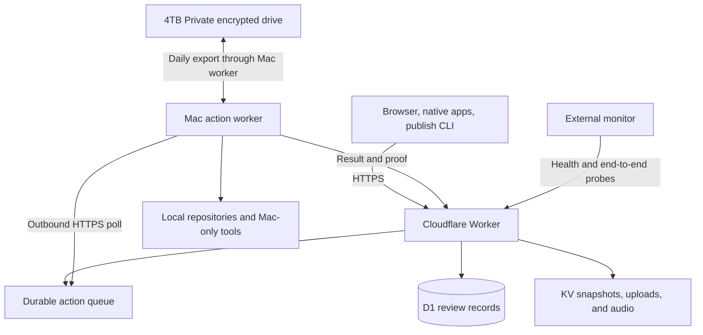
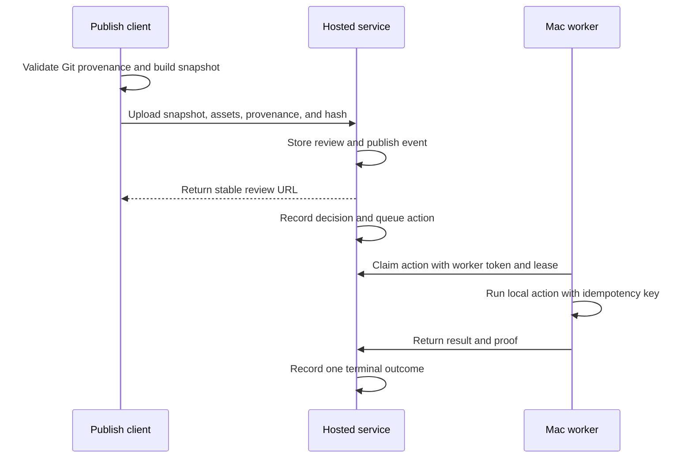

# Turf Review No-New-Cost Cloudflare Migration - Plan

<!-- turf-review: software-build-plan -->

## Goal Capsule

- **Objective:** Turf Review remains available for review and decision work when James's Mac or local web server is offline.
- **Means:** Rebuild the web and data service on the existing Cloudflare account, and keep Mac-only actions in an outbound Mac worker. See KTD1 and KTD2.
- **Authority:** This plan defines the migration contract. Live source and tests define implementation detail. A current production receipt defines completion.
- **Execution profile:** Use an isolated worktree. Preserve production data. Add no new subscription or metered service. Gate DNS and production changes on current approval.
- **Stop conditions:** Stop before cutover if backup restore, data comparison, worker idempotency, client compatibility, or rollback rehearsal fails.
- **Tail owner:** The implementation owner keeps the migration open through DNS validation, production smoke tests, backup proof, and the observation window.

---

## Product Contract

### Summary

Move the public Turf Review web service and its durable review data from James's Mac to the existing Cloudflare account.
Keep local repositories and Mac-only actions on the Mac.
Replace the Turf Review tunnel route with normal DNS after a staged migration and a tested rollback.
The migration must add no new monthly charge.

### Problem Frame

The public service depends on a local Node process and a Cloudflare Tunnel route to `localhost:3457`.
The production URL returned HTTP 502 on 28 August 2026 because no process listened on that port.
The local service file is not a valid LaunchAgent dictionary, and recent starts failed on missing Node packages.

The Mac worker also points to the failed local service.
This design makes the public review queue unavailable when the local web process fails.
It also mixes public hosting with trusted local execution.

### Requirements

**Availability and public access**

- R1. The public review UI and APIs must run on Cloudflare at `review.turfterrace.com` without a local web server or Turf Review tunnel route.
- R2. Users must be able to publish, read, annotate, and decide reviews while the Mac worker is offline.
- R3. The service must expose a health check that proves Worker readiness and access to D1 and KV.

**Data and source fidelity**

- R4. The migration must preserve reviews, decisions, requests, events, proofs, annotations, review targets, uploads, custom HTML assets, and required audio.
- R5. A consistent SQLite export, D1 import check, row-count comparison, and sampled content-hash comparison must gate each migration rehearsal and production cutover.
- R6. The hosted server must render immutable publish-time snapshots and must not read a local absolute source path.
- R7. The local publish tool must validate Git provenance before it sends a source snapshot and provenance record to the host.

**Trusted local execution**

- R8. Mac-only actions must run only on the Mac worker through outbound HTTPS polling.
- R9. A queued action must survive a Mac outage and must not complete more than once after retry or claim expiry.
- R10. The hosted service must not receive secrets for OmniFocus, Calendar, local Git, local outreach tools, or OpenClaw execution.

**Operations and recovery**

- R11. The hosted service must have hourly external monitoring, D1 Time Travel protection, a tested restore route, a daily encrypted export when the Mac worker is online, and an active stale-export alert when it is not.
- R12. Production cutover must use a short write freeze and a rollback that reconciles hosted writes before the old service becomes writable.
- R13. The shared Cloudflare Tunnel must continue to serve its other hostnames during and after this migration.
- R14. DNS changes, production data transfer, service shutdown, and any action that can create a new charge need current approval at action time.
- R15. The production design must add no subscription and no metered service that can silently create an extra bill.

### Key Decisions

- **Host the service, not the Mac actions.** This keeps public access independent from the Mac without moving trusted local capabilities to a public host. Governs R1, R2, R8, R10.
- **Preserve one writable primary.** The local and hosted databases must never accept writes at the same time during cutover or rollback. Governs R5, R12.
- **Keep the shared tunnel for unrelated services.** Remove only the Turf Review ingress after cutover. Governs R13.

### Acceptance Examples

- AE1. **Covers R2, R8, R9.** Given the Mac is offline, when James decides a review, then the hosted service records the decision and queues one job. When the Mac returns, the worker completes that job once.
- AE2. **Covers R4, R6.** Given a published custom-HTML review uses local images, when the Mac is offline, then the hosted review and all approved assets still render from stored snapshots.
- AE3. **Covers R5, R12.** Given the final write freeze is active, when records move to D1 and artifacts move to KV, then pre-cutover and post-cutover counts and selected hashes match before DNS changes.
- AE4. **Covers R12.** Given public validation fails before the write freeze ends, when rollback starts, then the old service becomes writable only after hosted changes are reconciled or proven absent.

### Success Criteria

- The public service passes an external check while the Mac web server is stopped.
- A publish, decision, queued Mac action, Worker deployment, and restore drill complete without lost or duplicate state.
- Production rollback is rehearsed before the DNS change.
- Public health, worker freshness, backup age, stuck jobs, and D1 and KV quota use have active alerts.

### Scope Boundaries

**In scope**

- The Express web service, SQLite data, stored media, publish protocol, Mac-worker protocol, hosting configuration, DNS cutover, backups, monitoring, and rollback.
- Web, Mac, iOS, CLI, and deep-link checks that prove current clients still work.

**Deferred to follow-up work**

- A Postgres migration. Reconsider it only when the service needs more than one web instance or concurrent writers.
- Cloudflare R2 object storage. Use KV within the free allowance and revisit Cloudflare R2 only with explicit approval if active artifacts approach the KV limit.
- Single sign-on. Harden the current single-user login and worker token for the first hosted release.

**Out of scope**

- Migration of the other hostnames in the shared Cloudflare Tunnel.
- Product redesign or changes to the meaning of current review decisions.

### Items to review

- [ ] Use the existing Cloudflare account with Workers, D1, and KV.
- [ ] Keep the hosted web service and Mac action worker as separate trust zones.
- [ ] Migrate the 36 MB SQLite database to D1 instead of paying for a persistent server volume.
- [ ] Use a short write freeze with a tested rollback for the final move.

Approval of this plan does not approve a DNS change, production data move, service shutdown, or activation of a billable Cloudflare product.

---

## Planning Contract

### Key Technical Decisions

- KTD1. **Use one Cloudflare Worker with D1 and KV on the existing account.** The account is active, already deploys a Worker, and has D1 access. Dynamic requests use the Worker, relational records use D1, and review artifacts use KV. Governs R1, R3, R4, R11, R15.
- KTD2. **Run a strict cloud service and a separate outbound Mac worker.** The Cloudflare code contains no Mac executors. The worker claims durable jobs over HTTPS. Governs R2, R8, R9, R10.
- KTD3. **Store immutable source snapshots and provenance records.** The publish client validates local Git state and sends content, repository identity, relative path, commit SHA when available, and content hash. The host never resolves a Mac path. Governs R4, R6, R7.
- KTD4. **Translate the current SQLite schema and queries to D1.** The current database is about 36 MB, below D1 Free's 500 MB per-database limit. Use D1 transactions and indexed queries within the free row-read and row-write limits. Governs R4, R5, R12, R15.
- KTD5. **Store only active artifacts in KV.** Current uploads and required audio total about 198 MB, below KV Free's 1 GB account limit, and the largest current file is about 2.2 MB, below KV's 25 MiB value limit. Exclude old database backups and the regenerable `tts-cache`. Store verified local backup copies on `/Volumes/4TB Private`. Governs R3, R4, R11, R15.
- KTD6. **Use a scoped worker token and expiring job leases.** Browser credentials must not authorize worker claims. Each action needs a durable idempotency key and terminal result. Governs R8, R9, R10.
- KTD7. **Use D1 Time Travel plus daily local exports.** D1 Free keeps seven days of point-in-time recovery. The Mac worker exports D1 records and new KV objects to the approved encrypted external drive each day it is online. Recovery tests must cover both routes. Governs R5, R11, R12.
- KTD8. **Bind the existing custom domain directly to the Worker.** Remove only the Turf Review tunnel ingress after the Worker route passes validation. Governs R1, R13.
- KTD9. **Stay on fail-closed free limits.** Do not enable Cloudflare R2. Confirm the account plan and billing behavior before resource creation. Record daily Worker, D1, and KV use. Stop new writes and alert before storage reaches 80 percent. Governs R3, R11, R14, R15.

### High-Level Technical Design

### Migration Sequence

1. Confirm that the Cloudflare plan and selected products cannot add a new charge.
2. Create and restore-test the baseline backup.
3. Build the Worker, D1, and KV adapter and remove local path reads.
4. Prove the Mac-worker protocol and failure cases.
5. Deploy a Cloudflare preview with copied data.
6. Rehearse data migration and rollback.
7. Freeze writes, copy the final delta, validate production, and change DNS.
8. Observe the service before old rollback material can be removed.

### Risks and Mitigations

| Risk | Consequence | Mitigation |
| --- | --- | --- |
| SQLite data is translated incorrectly to D1 | Missing or corrupt decisions | Use export, import checks, restored fixtures, counts, and hashes. |
| Hosted code reads Mac paths | Reviews or custom assets fail when the Mac is offline | Store immutable source and asset snapshots per KTD3. |
| A worker retries a claimed action | A send, task, or calendar action runs twice | Use leases, idempotency keys, and authoritative proof per KTD6. |
| Two databases accept writes | Decisions diverge during cutover or rollback | Enforce one writable primary and a write freeze per R12. |
| A broad tunnel stop breaks other sites | Unrelated services fail | Remove only the Turf Review ingress per KTD8. |
| KV reaches its 1 GB free limit | New uploads fail | Exclude caches and old backups, alert at 80 percent, and stop before the cap. |
| D1 or Worker daily limits are reached | Dynamic requests fail until reset | Measure preview use, index queries, alert early, and fail closed without charges. |
| Worker CPU exceeds 10 ms | Dynamic requests fail | Pre-render Markdown in the publish client, keep request work small, and test CPU use with production-shaped data. |
| Cloudflare or DNS change fails | Production remains unavailable | Validate on the preview URL first and keep a rehearsed rollback. |
| The worker stays offline without notice | Approved work remains stuck | Alert on worker freshness and job age per R11. |

### Host Alternatives

| Host | Fit | Decision |
| --- | --- | --- |
| Existing Cloudflare account | Already authenticated and already hosts a Worker. The current database and active artifacts fit the documented free limits. | Selected, subject to the no-new-charge gate. |
| Repair the local service | Cheapest implementation and useful as rollback. | Rejected as the end state because the service still fails when the Mac, power, or home network is offline. |
| GitHub Pages | Already available and free for static files. | Rejected because Turf Review needs authenticated writes, decisions, queues, and mutable data. |
| Railway, Render, Fly.io, or a VPS | Can run the current Node and SQLite design with less rewrite work. | Rejected because each adds a new hosting bill or a new server obligation. |

The target added hosting cost is **£0 per month**.
Cloudflare Workers Free stops at 100,000 dynamic requests per day instead of billing for more use.
D1 Free allows 500 MB per database, five million rows read per day, and 100,000 rows written per day.
KV Free allows 1 GB stored, 100,000 reads per day, and 1,000 writes per day.
The migration must stop if the account is on a billing model that can add unapproved overage charges.

---

## Implementation Units

### U1. Establish the migration baseline and recovery proof

- **Goal:** Create a verified source-of-truth backup and data manifest before code or hosting changes.
- **Requirements:** R4, R5, R11, R12.
- **Dependencies:** None.
- **Files:** `scripts/backup-review-data.js`, `scripts/verify-review-backup.js`, `test/backup-recovery.test.js`, `docs/runbooks/managed-hosting-migration.md`.
- **Approach:** Use SQLite's backup operation. Record table counts and selected hashes. Record media path, size, and SHA-256. Restore into a disposable data directory and run the integrity check.
- **Execution note:** Add recovery characterization before changing storage paths.
- **Patterns to follow:** Use `scripts/migrate-review-kernel.js` for timestamped backup behavior and `TURF_REVIEW_DATA_DIR` for isolation.
- **Test scenarios:**
  - Create a backup from a WAL-mode database with pending and archived reviews, then restore all expected rows and hashes.
  - Corrupt a backup copy, then make verification fail before any restore is accepted.
  - Remove one media file, then make manifest verification name the missing path.
- **Verification:** A disposable instance starts from the backup and opens sampled pending, archived, annotated, target-bearing, and proven reviews.

### U2. Build the Cloudflare Worker application boundary

- **Goal:** Run the review UI and APIs in a Worker with no Node server process and no Mac-only execution.
- **Requirements:** R1, R3, R4, R8, R10, R11, R15.
- **Dependencies:** U1.
- **Files:** `worker/wrangler.jsonc`, `worker/src/index.ts`, `worker/src/auth.ts`, `worker/src/routes/`, `worker/package.json`, `test/worker-auth.test.js`, `test/worker-routes.test.js`, `test/health.test.js`.
- **Approach:** Keep the current server as the behavior reference. Move routes behind a small Worker entry point. Serve bundled static assets without Worker execution where possible. Require authenticated access for review data. Use secure sessions, role-specific credentials, rate limits, and a health route that checks D1 and KV.
- **Execution note:** Treat this as a platform adapter, not an attempt to run Express unchanged inside Workers.
- **Patterns to follow:** Preserve the route contracts and response shapes in `server.js` while moving business rules into runtime-neutral modules.
- **Test scenarios:**
  - Start a preview Worker with D1 and KV bindings, then return 200 from `/healthz` only after both probes pass.
  - Remove a binding, then fail closed without serving private review data.
  - Send unauthenticated and wrong-role requests to each route class, then reject them.
  - Run production-shaped reads, writes, authentication, and rendering, then stay below the 10 ms CPU limit.
  - Attempt to import or call a Mac executor from the Worker build, then fail the deployment contract.
- **Verification:** Healthy D1 and KV bindings, compatible route responses, access controls, CPU limits, and exclusion of Mac executors pass before later units add complete product flows.

### U3. Replace local source reads with stored snapshots

- **Goal:** Move records to D1 and make Markdown, custom HTML, and approved assets independent of the source Mac after publish.
- **Requirements:** R4, R6, R7 and AE2.
- **Dependencies:** U1.
- **Files:** `scripts/turf-review.js`, `scripts/export-sqlite-for-d1.js`, `worker/migrations/`, `worker/src/repository.ts`, `worker/src/artifacts.ts`, `lib/reviews/source-paths.js`, `test/d1-migration.test.js`, `test/artifacts.test.js`, `test/turf-review-cli.test.js`, `test/render.test.js`.
- **Approach:** Convert the SQLite schema and data to D1-compatible migrations and import batches. Validate Git provenance in the client. Pre-render Markdown in the client to reduce Worker CPU. Upload immutable source and rendered snapshots, approved assets, repository metadata, and hashes. Store relational metadata in D1 and object content in KV. Backfill every current artifact while its local source remains available.
- **Execution note:** Start with failing publish and asset tests that run without the source repository.
- **Patterns to follow:** Extend `buildPublishPayload`, `classifyReviewArtifact`, the content-hash dedupe path, and review lifecycle events.
- **Test scenarios:**
  - Import the current SQLite fixture, then match every table count and sampled record hash in D1.
  - Publish a tracked Markdown file, remove the source directory, then render the same content and provenance from KV.
  - Publish custom HTML with approved relative images, remove the source directory, then serve all stored assets.
  - Include an untracked or out-of-root asset, then reject it before upload.
  - Publish the same content twice, then preserve dedupe behavior and the original snapshot hash.
  - Backfill an existing custom-HTML review, remove its source directory, then render all approved assets.
  - Reject any object above 25 MiB and stop migration if total active object storage would exceed 80 percent of 1 GB.
- **Verification:** No hosted route calls local file or Git operations for an existing review. D1 and KV remain below their free storage limits.

### U4. Secure and prove the Mac-worker protocol

- **Goal:** Queue trusted local work on the host and complete it once through outbound worker polling.
- **Requirements:** R2, R8, R9, R10 and AE1.
- **Dependencies:** U2, U3.
- **Files:** `scripts/mac-worker.js`, `lib/reviews/orchestrator.js`, `lib/reviews/repository.js`, `lib/db.js`, `server.js`, `worker/src/routes/`, `worker/src/auth.ts`, `worker/src/repository.ts`, `worker/migrations/`, `test/decision-orchestrator.test.js`, `test/kernel-lifecycle.test.js`, `test/worker-auth.test.js`.
- **Approach:** Add a scoped worker credential, expiring claims, idempotency keys, worker heartbeats, and one terminal result contract. Keep browser and publish credentials separate.
- **Execution note:** Use failure-first integration tests for claim expiry, retries, and duplicate completion.
- **Patterns to follow:** Extend the current worker claim and completion routes and append lifecycle events before projection updates.
- **Test scenarios:**
  - Take the Mac offline after a decision, then claim and complete the queued job when it returns.
  - Crash after claim, let the lease expire, then reclaim the same job without two completed actions.
  - Submit the same completion twice, then retain one terminal result and one authoritative proof.
  - Use a browser credential on a worker route, then reject it.
  - Use a worker credential on an administrator route, then reject it.
- **Verification:** Each synthetic action ends in verified success, a visible blocker, or a safe retry. No action completes twice.

### U5. Add Cloudflare deployment, free-limit controls, backups, and monitoring

- **Goal:** Define repeatable Cloudflare preview and production environments with no new charge, durable recovery, and alerts.
- **Requirements:** R1, R3, R11, R14, R15.
- **Dependencies:** U2, U3, U4.
- **Files:** `worker/wrangler.jsonc`, `.github/workflows/turf-review-health.yml`, `docs/runbooks/managed-hosting-migration.md`, `scripts/export-cloudflare-review-data.js`, `scripts/verify-review-backup.js`, `test/deployment-contract.test.js`.
- **Approach:** Confirm the account plan before resource creation. Create separate preview and production bindings and credentials. Do not enable Cloudflare R2. Add quota reporting and 80-percent alerts. Use an hourly GitHub Actions probe within the existing Actions allowance. Export D1 and new KV objects daily through the Mac worker to `/Volumes/4TB Private`, and test D1 Time Travel separately.
- **Execution note:** Stop if any selected setting can add a new charge. DNS and production data changes still need current approval.
- **Patterns to follow:** Keep configuration declarative and keep secrets out of the repository.
- **Test scenarios:**
  - Deploy a preview with copied production data, then retain D1 records and KV objects across Worker deployments.
  - Assert that preview and production use different D1 database IDs, KV namespace IDs, credentials, Worker names, and routes, and reject any preview configuration that points to production.
  - Break a binding, then fail health and raise the hourly external alert.
  - Reach a synthetic 80-percent quota threshold, then block new object writes and alert without enabling billing.
  - Make the daily encrypted export stale, then raise a backup-age alert.
  - Restore from D1 Time Travel and from the encrypted local export into disposable previews, then match baseline counts and hashes.
- **Verification:** Preview survives Worker redeploys, both restore routes pass, and current use stays within free limits with measured headroom.

### U6. Rehearse migration, cut over DNS, and observe production

- **Goal:** Move production data and traffic without divergence or impact to other tunnel services.
- **Requirements:** R1, R4, R5, R12, R13, R14 and AE3, AE4.
- **Dependencies:** U1, U2, U3, U4, U5.
- **Files:** `docs/runbooks/managed-hosting-migration.md`, `scripts/verify-review-backup.js`, `test/client-contract.test.js`.
- **Approach:** Import a production copy into the preview bindings. Verify web, Mac, iOS, CLI, deep links, custom assets, audio, decisions, and proofs. Repair and prove the local service as the rollback target. Rehearse forward and reverse moves. At cutover, lower DNS time-to-live, make the local service read-only, import the final delta, validate the Worker while cloud writes remain closed, bind the custom domain, switch the Mac worker, drain old DNS, enable cloud writes, and remove only the Turf Review tunnel ingress.
- **Execution note:** Treat production changes as approval-gated operations. Keep one writable primary.
- **Patterns to follow:** Use the public verification fields and status endpoint as evidence, not only a successful deploy event.
- **Test scenarios:**
  - Compare staged and source data, then fail the rehearsal on any missing row or selected hash mismatch.
  - Validate every supported client against staging, then record pass or exact blocker before cutover.
  - Fail public validation before cloud writes open, then prove hosted changes are absent and restore the local service.
  - After cloud writes open, create a hosted decision, reconcile it to the local service, and then restore the local service as writable.
  - Complete cutover, stop the Mac web server, then publish, decide, and complete one Mac action through the public Worker.
  - Remove the Turf Review tunnel ingress, then confirm all other configured tunnel hosts remain reachable.
- **Verification:** The production URL reaches the Worker directly. The full acceptance set passes during the observation window with no new charge.

---

## Verification Contract

| Gate | Scope | Required result |
| --- | --- | --- |
| Unit and integration tests | Existing Node tests plus Worker tests | All existing and new tests pass. |
| Worker preview | Cloudflare preview with disposable D1 and KV | Publish, render, decide, queue, redeploy, health, and CPU checks pass. |
| Migration proof | SQLite source, D1 target, and KV manifest | Row counts and selected hashes match. |
| Backup proof | D1 Time Travel and encrypted local export | Both restore paths match baseline counts and hashes. |
| Mac-worker proof | Cloudflare preview plus Mac worker | Offline recovery, lease expiry, retry, tamper rejection, and duplicate-side-effect cases pass. |
| Client proof | Web, Mac, iOS, CLI, and deep links | Current client flows work against staging and production. |
| Rollback proof | Rehearsed before DNS change | One writable primary is preserved and no hosted write is lost. |
| Free-limit proof | Current Cloudflare plan and production-shaped load | Use stays below 80 percent of each limit and cannot create a new charge. |
| Production proof | Public domain outside the Mac | Publish, decision, deployment, queued Mac action, backup, alert, and other tunnel hosts pass. |

The implementation must retain exact receipts for the final backup hash, table counts, selected content hashes, public DNS target, TLS result, worker completion proof, and monitoring state.

---

## Definition of Done

- R1-R15 and AE1-AE4 are satisfied with current evidence.
- U1-U6 meet their verification outcomes.
- `review.turfterrace.com` reaches the Cloudflare Worker without the Turf Review tunnel ingress.
- The public service works while the Mac web server is stopped and the Mac worker is offline.
- The worker uses outbound HTTPS and a scoped credential.
- No hosted route reads a Mac absolute path or runs a Mac-only action.
- Pre-cutover and post-cutover data counts and selected hashes match.
- A new publish and decision survive a Worker deployment.
- A queued Mac action survives an outage and completes once.
- D1 Time Travel, daily encrypted exports when the Mac worker is online, a stale-export alert when it is not, restore proof, external health, worker freshness, job-age, and quota alerts are active.
- Cloudflare and GitHub usage remain inside existing allowances, Cloudflare R2 remains disabled, and the migration adds no charge.
- The rollback rehearsal passed before DNS changed.
- The other shared-tunnel hostnames remain available.
- The observation window ends without unresolved data, action, security, or availability failures.
- Temporary migration data and abandoned implementation attempts are removed after the rollback-retention period and explicit approval.

---

## Appendix

### Current Evidence

- Cloudflare Tunnel maps `review.turfterrace.com` to `http://localhost:3457`.
- No process listened on port 3457 during inspection on 28 August 2026.
- The production domain returned HTTP 502 during the same inspection.
- The Mac worker ran against localhost and repeatedly logged failed fetches.
- `data/reviews.db` was about 36 MB and its WAL was about 4 MB.
- `data/` used about 327 MB. `tts-cache/` used about 657 MB.
- The publish client already sends document content, but hosted rendering and custom assets still contain local-path assumptions.
- The existing Cloudflare account is authenticated and already has a deployed Worker.
- No D1 database currently exists on the account. Cloudflare R2 is not enabled and is not part of this plan.
- Current uploads and required audio total about 198 MB. The largest current artifact is about 2.2 MB.
- The checkout contained many unrelated changes and was three commits ahead of its remote branch. Use an isolated worktree for implementation.

### Estimated Effort

| Work | Focused time |
| --- | ---: |
| Baseline and recovery proof | 0.5-1 day |
| Worker adapter, D1 migration, KV snapshots, and security split | 3-4.5 days |
| Cloudflare preview, quota proof, and Mac-worker proof | 1.5-2 days |
| Rehearsal, client checks, cutover, and observation | 1-1.5 days |
| **Total** | **6-9 days** |

### Sources and Research

- [Cloudflare Workers pricing](https://developers.cloudflare.com/workers/platform/pricing/)
- [Cloudflare Workers limits](https://developers.cloudflare.com/workers/platform/limits/)
- [Cloudflare D1 pricing](https://developers.cloudflare.com/d1/platform/pricing/)
- [Cloudflare D1 limits and Time Travel](https://developers.cloudflare.com/d1/platform/limits/)
- [Cloudflare Workers KV pricing](https://developers.cloudflare.com/kv/platform/pricing/)
- [Cloudflare Workers KV limits](https://developers.cloudflare.com/kv/platform/limits/)
